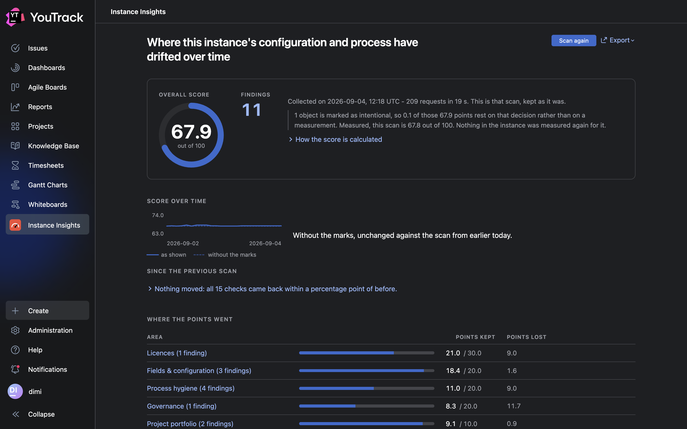

# Instance Insights

A YouTrack app that shows where an instance has drifted over time:
licences nobody uses, projects without an owner, custom fields that mean the same
thing under three different names, open work nobody has touched in months.



It reads, it never writes. A scan runs in the browser of the administrator who
starts it, with that administrator's own permissions - no service account, no stored
token, no background job - and produces a report with a score out of 100, the
findings behind it, and what resolving each one involves.

Built by [Ninjaneers GmbH](https://ninjaneers.de), MIT licensed.

## What you get

- **A score out of 100** you can recompute by hand, per category and per finding.
- **Findings with a number in the headline** - "3 of 3 licensed users changed nothing
  in 90 days" - each with why it is worth attention and when it is perfectly fine.
- **A *mark as intentional* button** on every finding, and one per named object -
  three of five nearly empty projects can be deliberate while the other two are not.
  The score moves with the decision, which is remembered instance-wide, and every
  report says how much of the score rests on decisions rather than on measurements.
- **A way from a finding to the thing it names**: every project and board in a
  finding links into the instance, and a counted number carries the search behind it,
  so the report can be checked rather than believed.
- **A report that is still there tomorrow**: the last scan is kept, so opening the
  page shows it again without asking the instance anything. It says when it was
  collected, and a scan away is the current state.
- **A trend** over the last 24 scans, in the report and on a dashboard tile, with the
  movement spelled out: what improved, what got worse, what is new. The tile shows
  the score and leads to the report; scanning happens on the report page, where
  somebody is watching a job that takes minutes.
- **Two exports, for the two places a report goes**: a printable document to hand
  on outside the instance, and Markdown to paste back into it - into the issue that
  tracks the cleanup. Both count affected accounts without naming them, and both
  keep the score terms of every finding so the number can be checked without the app.

The report page and the dashboard tile are visible only to accounts that may update
apps - the same permission that guards the app's own storage. A scan sees what the
account running it may read, and a report over half an instance would look exactly
like a report over all of it.

## Install

From the JetBrains Marketplace, or from source into your own instance:

```bash
npm install
npm run build
npm run upload -- --host https://youtrack.example.com --token perm-...
```

The token is a permanent token from an administrator's profile, used as it is.
*Instance Insights* then appears in the main menu, and the score tile can be added
to any dashboard.

It needs YouTrack 2024.3 or newer, which is where an app may keep its own data on
the instance. On versions before 2026.2 it needs the classic interface: with
YouTrack Lite switched on, the dashboard tile does not appear.

## The score

The score is a hundred points, and every figure in the report is a slice of that
same hundred - a category, a check, a finding. So they add up, and the reader can
follow one number back to the check that took it away.

```
category points   = 100 * category weight / sum(weights of the categories that scored)
check points      = category points * check weight / sum(weights of the checks that ran there)
points it loses   = check points * ratio     (ratio 0..1, supplied by the check)
score             = 100 - sum(points lost)
```

- Only checks with a measurement carry points. One that found nothing in the
  instance to measure - no boards at all, say - or that hit an error leaves its
  points to its neighbours rather than counting as zero, so it neither helps nor
  hurts the score. The same goes for a whole category that could not be measured.
- Ratios are continuous. A check that trips just over its threshold takes away a
  little, so the score does not jump.
- A finding marked as intentional keeps its points and loses what it took away. That
  is what lifts the score when the team decides something is fine as it is - and
  every report states how many points rest on such decisions.
- Single objects can be marked too, where a check names them: the share is then
  measured on what is left. An object carries the weight it was measured with, so a
  project holding four hundred issues takes those four hundred out of the count,
  not one project out of a list. Where the objects are accounts there is no such
  button: nothing about a person is stored.

Severity (critical, high, medium, low) follows from the ratio. It orders the findings
and colours them; it is not part of the arithmetic.

## The checks

The weights below are what those shares are computed from: a category's weight
against the other categories, a check's weight against the other checks in its
category.

| Check | Category (weight) | Weight |
|---|---|---|
| `licensing.inactive-users` | Licences (3) | 10 |
| `fields.unused-global-field` | Fields & configuration (2) | 6 |
| `fields.empty-field` | Fields & configuration (2) | 8 |
| `fields.cloned-value-lists` | Fields & configuration (2) | 7 |
| `fields.required-but-empty` | Fields & configuration (2) | 9 |
| `fields.duplicate-field-names` | Fields & configuration (2) | 10 |
| `fields.state-without-resolved` | Fields & configuration (2) | 10 |
| `process.unassigned-unresolved` | Process hygiene (2) | 6 |
| `process.stale-unresolved` | Process hygiene (2) | 8 |
| `process.intake-vs-throughput` | Process hygiene (2) | 7 |
| `process.boards-without-wip-limits` | Process hygiene (2) | 5 |
| `process.overgrown-boards` | Process hygiene (2) | 4 |
| `process.boards-on-archived-projects` | Process hygiene (2) | 3 |
| `governance.projects-without-leader` | Governance (2) | 8 |
| `governance.empty-groups` | Governance (2) | 4 |
| `governance.open-work-of-blocked-accounts` | Governance (2) | 7 |
| `governance.boards-owned-by-blocked-accounts` | Governance (2) | 3 |
| `portfolio.dormant-projects` | Project portfolio (1) | 7 |
| `portfolio.tiny-projects` | Project portfolio (1) | 5 |
| `instance.memory-below-database` | Instance setup (2) | 6 |
| `instance.no-way-to-notify` | Instance setup (2) | 5 |
| `instance.address-only-works-here` | Instance setup (2) | 4 |

Thresholds live in `DEFAULT_CONFIG` (`src/types.ts`): 90 days without activity for a
licence, 180 days without an update for a stale issue, 95 % empty for a field,
20 % unassigned, more than seven columns for a board, fewer than ten issues for a
project, and a 90-day window for what arrives against what gets finished. Every finding says when it may be
firing on something intentional, and none of them states a duration for the work - an
estimate for an instance the app has never seen would be a guess.

A few definitions are worth knowing, because they are not the obvious ones:

- **Inactive licences are measured by changes, not by sign-ins.** No API the app can
  reach exposes a last-login time, so the check reads the activity of each account:
  issues created, comments, field edits, attachments, tags, votes, logged work. That
  gives a date, so the report can distinguish "last change in February" from "no
  trace at all". Accounts registered inside the window are left out, and someone who
  only reads leaves no trace at all - both cases are named in the finding, along with
  the place that does record them, the account's own Account Security page.
- **Empty fields are measured per field.** One search counts the issues that carry a
  value; the reference is the number of issues in the projects the field is
  instantiated in. So the check costs one request per field regardless of how many
  projects there are, and still looks at every issue rather than a sample.
- **A required field is measured against the projects that require it.** A project
  can declare that a field must hold a value, and the same field can be optional in
  the next project. So the reference is the issues of the projects that demand a
  value, and one search per field asks how many of them carry one. What the finding
  states is the difference, which is a contradiction of the instance's own rule
  rather than a matter of taste.
- **Copies of a value list are counted as copies, not as lists.** A list that exists
  forty times over is one list and thirty-nine copies, and the order the values are
  listed in is not a difference between them. Comparison is by the values, so two
  lists with the same values under different names are the same list.
- **What arrives is compared with what gets finished, over the same 90 days.** Two
  dates the instance records: when an issue was created, and when it was resolved.
  Both windows are absolute dates, and an issue that arrived and was finished inside
  the window counts on both sides - which is what makes the pair a measure of flow
  rather than of backlog size.
- **A card counts as being on a board, not as being in its projects.** The two are
  not the same: a board shows the cards placed on it, and an issue can sit in one of
  its projects without ever appearing there. So a board is asked about itself -
  YouTrack exposes each board as a field carrying the sprint a card sits in, so a
  board can be asked what it holds.
- **WIP limits are only asked of boards that plan without sprints.** A sprint board
  limits work through the sprint it commits to, so a missing column limit there is
  not a finding. A board of two columns has nowhere to put one, and an empty board
  has nothing to limit, so both are left out - the finding names the boards in use
  with no limit anywhere, and how many cards each of them holds.
- **Nothing here claims to know which column is work and which is a queue.** An
  instance does not say: a state bundle marks only what counts as resolved, and a
  real vocabulary holds On Hold beside In Review with nothing to tell them apart. So
  no finding is built on that difference. What is measured instead is what an
  instance does state - whether an issue is resolved, and when it last moved.

Three checks look at the server rather than at the work in it - its memory against
its database, whether it can send an email at all, and whether the address in its
links resolves anywhere but on the server. Those apply to an instance you run
yourself. On an instance run for you, they step aside with a sentence saying so, and
the points they would have carried go to the other categories rather than counting
as zero - so a score of 82 on a hosted instance and a score of 82 on your own server
are not answers to the same question.

## What it reads, and what it keeps

The scan reads counts, IDs and timestamps over the REST API, and - where the instance
will say - a few settings of its own: the size of its database, the memory it has,
whether email is switched on, whether an address is set for messages about the
instance, and the address it puts into the links it sends. The address that is set is
never read, only whether there is one. It writes nothing to the instance and sends
nothing anywhere else.

Between visits the app keeps four things, all of them in the instance's own
database and none of them anywhere else.

The numbers of the last twenty-four scans: the score, the score before anything was
marked as intentional, the number of findings, a timestamp, and per check its own ID
with the ratio it measured. That is the trend.

The report of the most recent scan, so that opening the page again does not mean
scanning again: per check its headline with the numbers in it, the evidence beneath
it, and the configuration objects it named - projects, boards, fields, groups. A
report read back this way says when it was collected and that a new scan is what
answers for the present.

What an administrator marked as intentional: a check by its ID, single objects by
theirs.

And the time a scan was last started. The report page and the score tile can both
scan, and two scans at once ask the instance everything twice - so whichever one is
opened second says that a scan is already under way, and how long ago it began. It
says it and leaves the button alone: nothing here locks the app, and a scan whose
browser was closed cannot leave it stuck.

Who can read all this is the instance's own business, and it is settled twice. Both
views require permission to manage apps, and so does each of the four endpoints the
app answers on - so what it keeps is readable to administrators and to nobody else.
Adding people to the app's visibility in YouTrack does not change that, and it
cannot widen what a scan sees either: every request runs with the permissions of the
person who opened the page, never with permissions of the app's own.

Accounts appear in none of it. The licence check names the people behind its number
on the page, because the finding cannot be acted on otherwise, but those names are
not written down: a dated list of who did not use their seat would outlive the
account it describes and the reason it was made. The kept report states the count and
says that a scan names them again. No issue content, no summaries, no free text from
the instance.

## Load on your instance

A scan's cost follows the size of the instance, not its traffic: one search per
account, two per project, two per custom field, one per board, and seventeen for the
lists it reads and the counts it asks once for the whole instance. Those add up to
the totals below, which is the point of stating them.

| Instance | Requests |
|---|---|
| 25 accounts - 10 projects - 5 boards - 20 fields | 107 |
| 100 accounts - 50 projects - 20 boards - 40 fields | 317 |
| 500 accounts - 200 projects - 60 boards - 80 fields | 1 137 |
| 2 000 accounts - 800 projects - 200 boards - 150 fields | 4 117 |

The two per field are the upper bound: one asks whether the field is filled at all,
the second only applies to a field some project demands a value for. An account
costs one search either way - when it last changed something if it holds a licence,
what open work it still holds if it has been blocked.

Requests start at least 50 ms apart - at most twenty a second, whatever else is going
on. That ceiling is the promise to the instance, and it does not move.

Underneath it, the scan starts with one request in flight and allows a second and a
third only while the instance keeps answering quickly. The first 429 or 503 puts it
back to one for the rest of the run: a rate limit is a statement, not a hint. This is
what keeps a scan of a large instance from spending most of its time waiting for
answers it could have asked for in parallel - the instance is asked no more per
second than before, just with less idle time in between.

Every list is read once per scan and shared by all checks, and a request that does
not answer within 30 seconds is abandoned. A count the instance is still computing is
asked for again after 100 ms, then at growing intervals. The scan can be stopped at
any point; stopping keeps what was measured on the page and stores none of it -
neither on the trend nor as the report the next visit opens with, because a part of
an instance and a whole one cannot be compared.

The report states what the run cost - how many requests, how long, and whether the
instance asked for a pause along the way. A scan that slowed down halfway through
says why it did.

Nothing runs in the background: no scheduled job, no worker, no scan that starts by
itself. Closing the page ends the scan.

How long that takes depends on the instance answering, so the scan does not guess: it
counts its own requests and seconds while it runs, and the finished report states
both. `node scripts/load-profile.ts` prints the table above against an in-memory
instance, and `--measure N` times real requests against your own.

## Development

Node >= 22.18 (it runs TypeScript without a build step; `nvm use` reads `.nvmrc`), npm,
and Docker if you want to try things against a local instance.

```bash
nvm use
npm install
npm run check
```

| Command | Effect |
|---|---|
| `npm run check` | Typecheck plus tests - the gate before a commit |
| `npm test` | Tests only (`npm run test:watch` for watch mode) |
| `npm run lint` | ESLint over the widget code and the JSON files |
| `npm run dev` | Vite dev server; `/dev/` renders a widget outside YouTrack |
| `npm run probe` | Fires every API assumption at a real instance (reads `.env`) |
| `npm run scan` | Full scan against a real instance, printed to the terminal |
| `npm run build` | Builds into `dist/` and validates the manifest |
| `npm run pack` | Packs `dist/` into `instance-insights.zip` |
| `npm run upload` | Installs the built app into an instance |
| `npm run deploy` | Builds and installs into the instance in `.env`, with a build number in the version so YouTrack serves the new widget instead of its cached one |

The code runs in four places, and each is type-checked on its own terms: the engine
and its tests in Node, the widgets in a browser, the Vite configuration, and the
HTTP handler in YouTrack's own sandbox. The handler is the odd one - it is copied
into the package as plain JavaScript, because that is what the sandbox runs - so its
types live in JSDoc, and it names the stored shapes from the engine rather than
repeating them. A comment carries no code into the package, and a change to a stored
shape fails the check instead of reaching an instance.

Copy `.env.example` to `.env` for the base URL and token of your test instance. It is
gitignored, and the dev server keeps the token on the server side so it never reaches
the browser.

### Looking at a widget

Inside YouTrack a widget runs in an iframe sandboxed without `allow-same-origin`, so
its document has an opaque origin, and some browsers give such a document no network
access at all - every app widget then fails to load, YouTrack's own included. To work
on a widget without depending on that, `npm run dev` serves it in a page with a real
origin:

```
http://localhost:5173/dev/?widget=report&scenario=trend&theme=dark
```

REST calls are proxied to the instance from `.env`, the app's own storage is kept in
the session, and `scenario=trend` seeds two earlier scans so the trend has something
to show. The sandbox itself is not emulated, so the print window, the download and
the clipboard still have to be tried inside YouTrack.

### Layout

```
src/
  types.ts          Domain types, constants, the YouTrackClient interface
  youtrack-api.ts   REST mapping: paths, field selectors, pacing, retries
  client.ts         Node transport with a permanent token (probe, scan)
  host-client.ts    Browser transport over host.fetchYouTrack
  engine.ts         Running the checks, and scoring their outcomes
  checks/catalog.ts The check catalog
  scan-session.ts   One scan: the mark it sets, its cost, what is kept of it
  report-shared.ts  What all three reports say the same way
  report-markdown.ts, report-print.ts   The two exports, pure functions
  trend.ts          Score history: delta, wording, sparkline
  stored-run.ts     What a scan sends to be kept, and how it comes back
  app-state.ts      Typed client for the backend handler
  backend.js        HTTP handler over the app's global storage
  dev/              Dev entry with a Host API stub, never part of the package
  widgets/report/   Main menu item: the report page
  widgets/score/    Dashboard widget: the score tile
test/               node:test suites against an in-memory instance
scripts/            probe, scan, load profile, deploy
```

One npm project with two halves. The engine runs in Node without a build, so `.ts`
files execute directly and `tsc` only type-checks; the widgets are built with Vite
into `dist/`, and they import the engine as source, so there is no second copy of the
scan logic in the frontend. `erasableSyntaxOnly` is on, which rules out `enum`,
`namespace`, parameter properties and decorators.

Checks depend only on the `YouTrackClient` interface - no HTTP, no URLs - so they can
be tested against an in-memory instance, and a corrected REST path touches one file.
REST paths and field selectors live in `youtrack-api.ts`, the YouTrack search queries
in `catalog.ts`. `ScanContext` carries an injected `now`, so tests do not depend on
the calendar.

The backend handler exists because both widgets have to agree on the last scan: one
started on the report page has to show up on the tile. The Host API's own storage
keeps values in the visitor's browser and is not tied to a YouTrack account, so the
shared facts live in `AppGlobalStorage`, which is reachable from a handler only.
Saving the same timestamp twice revises that point of the trend instead of adding
one, because marking a finding re-scores a scan that already happened.

## Notes on the YouTrack API

`npm run probe` fires every assumption in the app at a real instance and reports what
answered - 15 of 15 against `jetbrains/youtrack:2026.2.18194`. A few things there were
worth learning:

- **A collection comes back with 42 entries** unless `$top` says otherwise, so every
  list is paged explicitly. Without that, an instance with 500 users is reported on as
  if it had 42 - plausible numbers about a different instance.
- **An archived project cannot be used as a search scope.** `project: {KEY}` for an
  archived project is rejected as an unparseable query rather than answered with
  zero - "The value ... isn't used for the project field". Archived projects therefore
  stay out of every query, and they carry no issue total: null rather than zero,
  because zero would be a claim about something nobody counted.
- **A search for an attribute YouTrack does not know answers zero**, not an error, so
  a count of zero never proves a query means what it looks like. Every attribute the
  checks rely on was confirmed with a non-zero answer on a live instance.
- **The query parser wants its `and` spelled out.** A parenthesised group is rejected
  without an explicit `and` in front of it, and a comma-separated value list is
  rejected after a project clause: `project: A, B and ({State}: {Open} or {State}:
  {Review})` works, the shorter forms are errors.
- **The count endpoint may answer `-1`** while it is still computing, even on an
  instance with twenty issues, so the client polls.
- **Last-login times are Hub data and out of reach** for an app: the full-page widget
  has no `host.fetchHub()`, `host.fetchYouTrack` refuses anything outside the REST
  root, and the app's own handler arrives at Hub unauthenticated. That is why the
  licence check judges activity instead.

A local instance is useful but not sufficient: rate limiting cannot be observed on
twenty issues.

## Licence

MIT - see [LICENSE](./LICENSE).

The widgets are built on ring-ui, the JetBrains icon set and React, so the
installed package carries compiled copies of them. Their licences travel with it,
in [THIRD-PARTY-NOTICES.md](./THIRD-PARTY-NOTICES.md).
